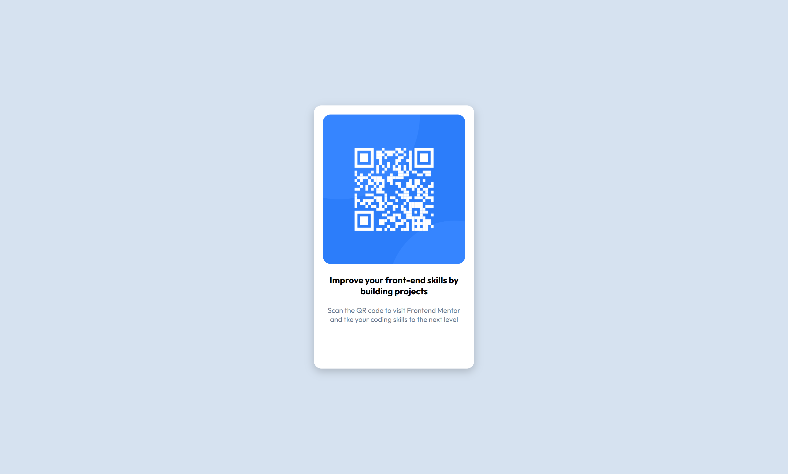

# Frontend Mentor - QR code component solution

This is my solution to the [QR code component challenge on Frontend Mentor](https://www.frontendmentor.io/challenges/qr-code-component-iux_sIO_H).  
Frontend Mentor challenges help me improve my coding skills by building realistic projects.

## Table of contents

- [Overview](#overview)
  - [Screenshot](#screenshot)
  - [Links](#links)
- [My process](#my-process)
  - [Built with](#built-with)
  - [What I learned](#what-i-learned)
  - [Continued development](#continued-development)
  - [Useful resources](#useful-resources)
- [Author](#author)

## Overview

### Screenshot

[Screenshot of my solution for small screen](./images/screenshot-sm-screen.png)

### Links

- Solution URL: https://github.com/AndresChernin/qr-code-component  
- Live Site URL: [Add live site URL here](https://your-live-site-url.com)

## My process

- First, I set up the body as a flexbox.  
- Inside the flexbox, I centered the `div` with the class `qr-class` both horizontally and     vertically.  
- Then, I added the `img`, `h2`, and `p` tags.  
- I adjusted the CSS classes: I experimented with different sizes so that my solution looked as close as possible to the preview image.  
- Finally, I worked on the colors and responsive design to make the component look good on different screen sizes.

### Built with

- Semantic HTML5 markup  
- CSS custom properties  
- Flexbox  
- Mobile-first workflow  

### What I learned

This was my first Frontend Mentor challenge.  
I learned how to:
- Use Flexbox to center elements both vertically and horizontally.  
- Apply `border-radius` to create rounded corners.  
- Use media queries to make the design responsive for very small screens.  
- Import and apply Google Fonts.  

### Continued development

### Continued development

My next goal is to complete the **Single-page developer portfolio challenge**.  
After that, I want to move to **intermediate-level challenges** as quickly as possible in order to practice more advanced layouts and responsive designs.
 

### Useful resources

- [MDN Web Docs](https://developer.mozilla.org/) - Helpful documentation on HTML and CSS.  
- [Google Fonts](https://fonts.google.com/) - Used to add the **Outfit** font family.  
- [Frontend Mentor](https://www.frontendmentor.io/) - For the challenge and practice.  

## Author

- Frontend Mentor - [@yourusername](https://www.frontendmentor.io/profile/yourusername)  
- GitHub - [yourusername](https://github.com/yourusername)  
  

